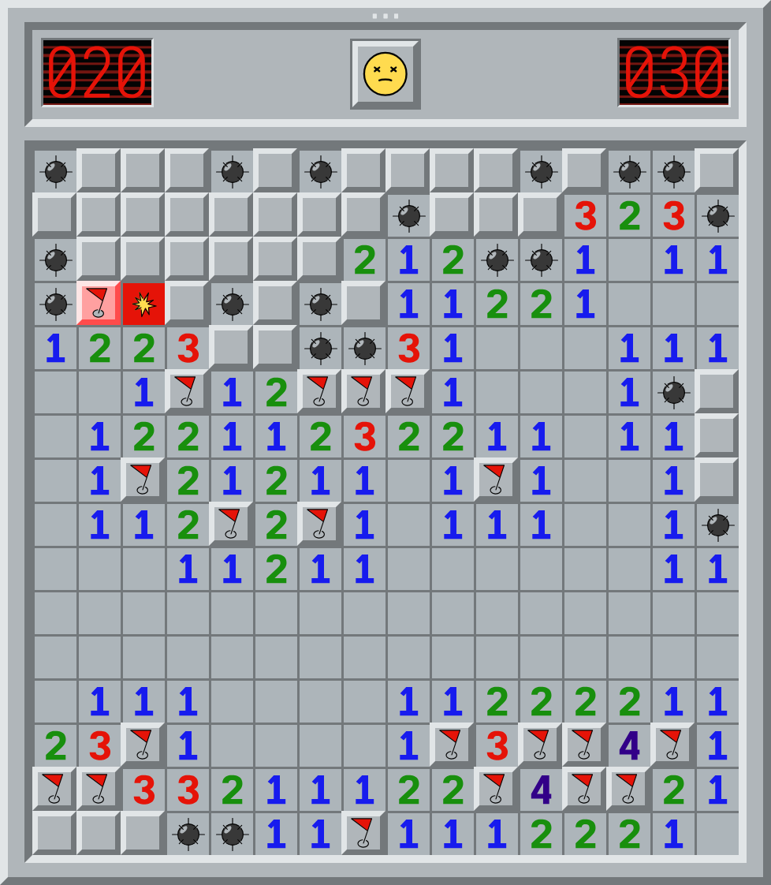

  <a href="https://sugoijan.dev/detonito/">
    <picture>
      <source media="(prefers-color-scheme: dark)" srcset="docs/screenshot-dark.png">
      
    </picture>
  </a>
   
  <strong>a minimal minesweeper clone</strong>

## Build it yourself

For normal development builds you'll need Rust, trunk, Sass, Wrangler, Caddy, and just.

Use `just dev` for local Worker-backed development. It starts:

- Caddy on `http://localhost:4365`
- Trunk on `http://127.0.0.1:4361`
- Wrangler on `http://127.0.0.1:4377`
- Wrangler inspector on `http://127.0.0.1:4388`

Alternatively use `just web` for a simpler workflow that only runs Trunk and skips the AFK mode stuff.

## License

Licensed under either of

* Apache License, Version 2.0, ([LICENSE_APACHE](LICENSE_APACHE) or http://www.apache.org/licenses/LICENSE-2.0)
* MIT license ([LICENSE_MIT](LICENSE_MIT) or http://opensource.org/licenses/MIT)

at your option.

## Contributing

Unless you explicitly state otherwise, any contribution intentionally
submitted for inclusion in the work by you, as defined in the Apache-2.0
license, shall be dual licensed as above, without any additional terms or
conditions.
